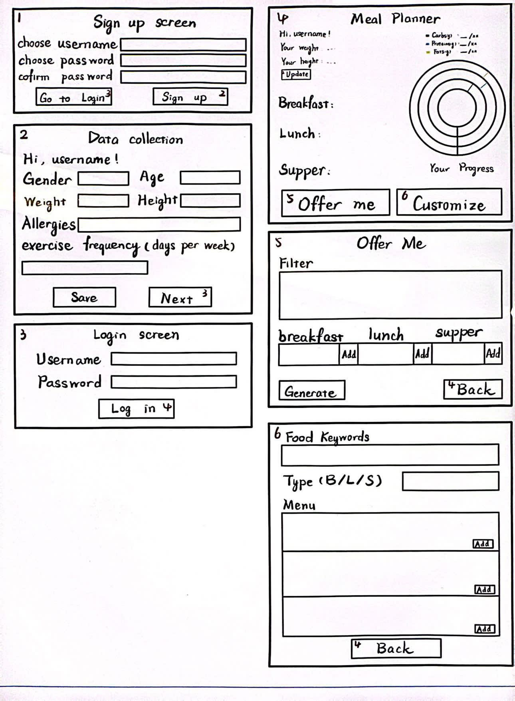

## CSC207-Project-Group-18
Team name: ありがとう (Arigatou)

Members: Zihan Jin, Hao Hu, Chuxuan Ai, Jeffrey Shen

Github names: JeromeJinzh (Zihan), HARDY130 (Hao), Chuxuan-a (Chuxuan), jeffreyshen0 (Jeffrey)

User stories:

Chuxuan -- As a user, I want agit  personal account to record my health data and provide a nutritional analysis. From a user interaction perspective, this app should have a signup page, a login page, and a display page for personal analysis.

Jeffrey -- As a user, I would like this app to offer me a daily meal plan based on my health data. In terms of user interaction, it is to show the daily meal schedule through a clear window.

Hao -- As a user, I hope to be able to customize the diet plan provided by our app. From the point of user interaction, there must be a sub-setting page for users to modify and update the existing plan.

Zihan -- As a user, I want to understand the nutrition of the foods I have. From the user interaction view, our application should provide a search function and display analyzed results im the main window.

App views:

The main views are finished. Some core functions are implemented, and other parts are on their way (waiting for the feedback data).