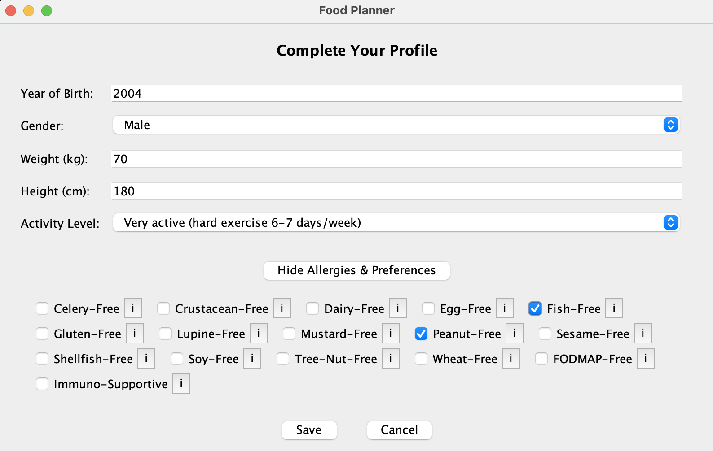
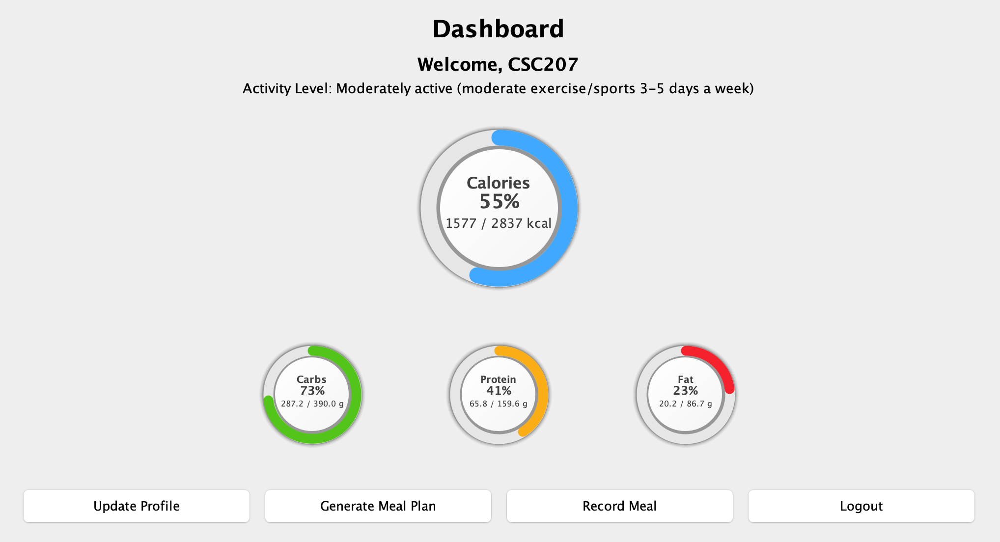
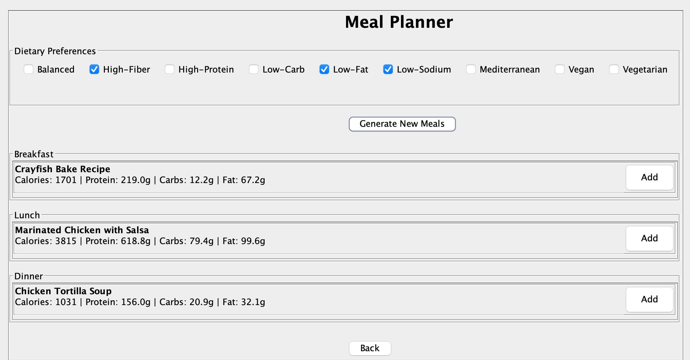
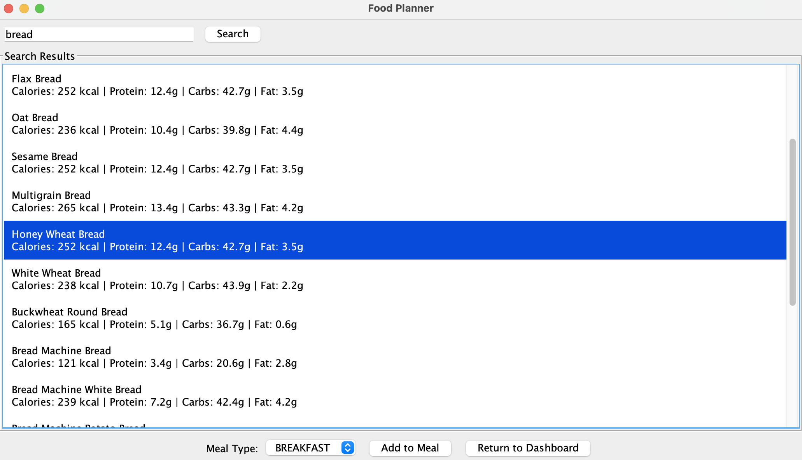

# **いただきます Nutritional Assistant**

*Pronounced as (I-ta-da-ki-ma-su Nutritional assistant)*

**Contributors:** Hao Hu, Zihan Jin, Jeffrey Shen, Chuxuan Ai

---

## 📑 Table of Contents
- [The What](#the-what)
- [The Purpose](#the-purpose)
- [Software Features](#software-features)
    - [Goal-Based Nutrition Tracker](#goal-based-nutrition-tracker)
    - [Meal Planner](#meal-planner)
    - [Food Customizer](#food-customizer)
- [Installation](#installation)
- [Usage Guide](#usage-guide)
- [License](#license)
- [Feedback](#feedback)
- [Contributions](#contributions)

---

## 💡 The What

Our program is a Nutritional Assistant, which was designed to help users figure out and manage their recommended macronutrient and calorie levels. The program determines a recommended nutritional threshold, allows the user to search up recipes and nutritional information about the dishes they prepare, and can generate a recommended comprehensive meal plan for the entire day, based on user specification.

The nomenclature of our program's name, Romanized: (itadakimasu) comes from Japanese culture, where "いただきます" is a phrase said before eating to express gratitude for the food, the people who prepared it, and the ingredients. It conveys mindfulness and respect toward the act of eating.

## 🎯 The Purpose

We wanted to promote simple wellbeing and health to all demographics, regardless of allergies, personal health goals, or dietary restrictions. Making use of the EDAMAM api, we wanted to make the various processes of healthy living more accessible by combining these elements into a single program. Whether it was meal-prepping, or tracking macronutrients to maximize weight loss, these tasks can become arduous due to the different sources of information required to adhere to these tasks. Our program aims to simplify this process.

## ⭐ Software Features

### Goal-Based Nutrition Tracker
This feature provides a dynamic, user-specific nutrition tracking and goal-setting system. Descriptions are as follows:
- Calculates user's daily calorie and macronutrient goals
- Displays progress using charts and progress bars
- Encourages balanced diet through nutrition monitoring

> **Example Usecase:** A lightly active user with a daily calorie target of 2,241 kcal can quickly see the nutrition goal on the panel. Macronutrient breakdowns are displayed as progress rings.

### Meal Planner
This feature helps users create meal plans tailored to their dietary preferences:
- Select dietary filters (Balanced, High-Protein, Low-Carb, etc.)
- Auto-generates nutritionally balanced meals
- Displays nutritional values for easy tracking

> **Example Usecase:** A user with "Low-Carb" preference can select the filter to receive appropriate meal options.

### Food Customizer
This feature allows users to create customized meal options:
- Search foods by keywords
- View detailed nutritional information
- Assign meals to specific meal types
- Track nutritional progress

> **Example Usecase:** Search "chicken" for lunch, select Chicken Stir-Fry, assign to Lunch meal type.

## 🔧 Installation

### Prerequisites
- Java Development Kit (JDK) version 17 or higher
- An IDE (IntelliJ IDEA, Eclipse) or text editor with Java support
- [Optional] Java runtime environment (JRE)

### Setup Instructions
1. Clone the repository:
```bash
git clone https://github.com/HARDY130/CSC207-Project-Group-18.git
```

2. Open the project in your IDE
3. Ensure IDE's project SDK is set correctly
4. Locate the main class file (Main.java)
5. Run the application

## 📖 Usage Guide

Get started with いただきます Nutritional Assistant through these core features:

### 1. Complete Your Profile
<div align="center">
  
  <p><em>Set up your profile with personal metrics and dietary preferences</em></p>
</div>

Here you can enter your:
- Year of Birth
- Gender (Male/Female)
- Weight (kg) and Height (cm)
- Activity Level
- Allergies & Preferences

### 2. Dashboard Overview
<div align="center">
  
  <p><em>Track your daily nutrition progress and access key features</em></p>
</div>

The dashboard provides:
- Nutritional progress visualization
- Quick access to all features
- Daily goal tracking
- Recent activity summary

### 3. Meal Planning
<div align="center">
  
  <p><em>Generate personalized meal plans based on your preferences</em></p>
</div>

Features:
- Select dietary preferences
- View nutritional information
- Add meals to your plan
- Track nutritional goals

### 4. Food Customization
<div align="center">
  
  <p><em>Search and customize your meals with detailed nutritional information</em></p>
</div>

Capabilities:
- Search for specific foods
- View detailed nutritional content
- Add to any meal type
- Track your daily intake

## 📜 License

This project is licensed under the MIT License.

```text
MIT License

Copyright (c) 2024 Hao Hu, Zihan Jin, Jeffrey Shen, Chuxuan Ai

Permission is hereby granted, free of charge, to any person obtaining a copy
of this software and associated documentation files (the "Software"), to deal
in the Software without restriction, including without limitation the rights
to use, copy, modify, merge, publish, distribute, sublicense, and/or sell
copies of the Software, and to permit persons to whom the Software is
furnished to do so, subject to the following conditions:

The above copyright notice and this permission notice shall be included in all
copies or substantial portions of the Software.

THE SOFTWARE IS PROVIDED "AS IS", WITHOUT WARRANTY OF ANY KIND, EXPRESS OR
IMPLIED, INCLUDING BUT NOT LIMITED TO THE WARRANTIES OF MERCHANTABILITY,
FITNESS FOR A PARTICULAR PURPOSE AND NONINFRINGEMENT. IN NO EVENT SHALL THE
AUTHORS OR COPYRIGHT HOLDERS BE LIABLE FOR ANY CLAIM, DAMAGES OR OTHER
LIABILITY, WHETHER IN AN ACTION OF CONTRACT, TORT OR OTHERWISE, ARISING FROM,
OUT OF OR IN CONNECTION WITH THE SOFTWARE OR THE USE OR OTHER DEALINGS IN THE
SOFTWARE.
```

## 💭 Feedback

We highly value your feedback! Here's how you can share your thoughts:

📝 **Submit via Google Form:** [Feedback Form](https://forms.gle/WFM5E3Kqt7yRt9ZDA)

**Guidelines for valid feedback:**
- Be specific with examples
- Take time for thoughtful responses
- Suggest changes that benefit all users

## 🤝 Contributions

We welcome contributions to enhance いただきます:

1. Fork the repository
2. Clone locally
3. Make changes
4. Create pull request with:
    - Clear description
    - Testing evidence
    - Updated documentation

**All pull requests reviewed by project owners.**

---
